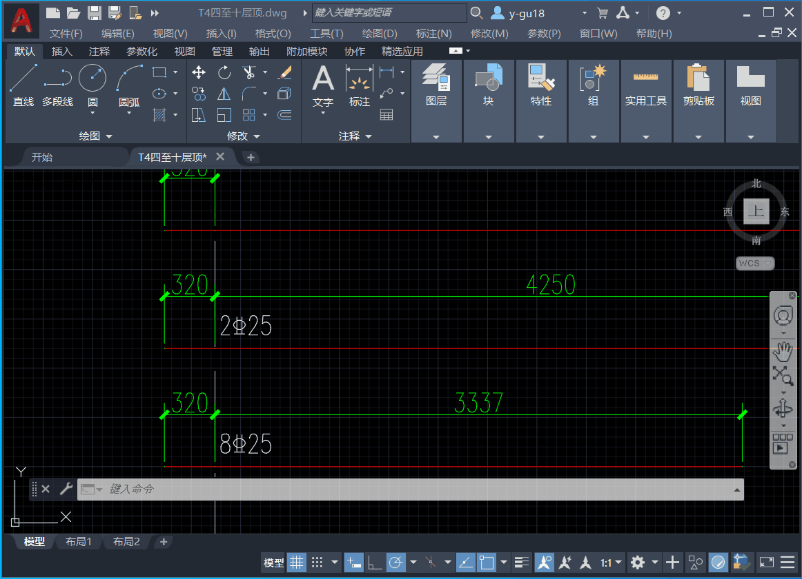
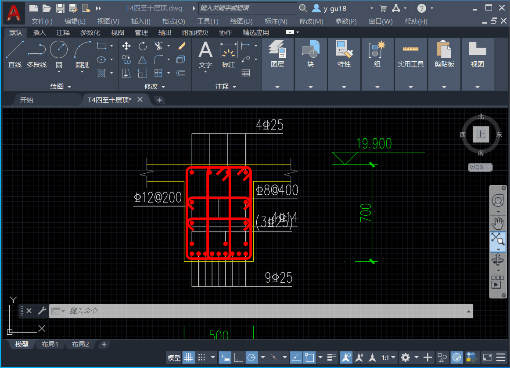

# CAD_YJK

AutoCAD 插件，本插件用于处理YJK软件生成的施工图（修改钢筋锚固长度）


## 命令示例

```
YJK - 初始化所有表，计算截面配筋，自动标注支座钢筋
I   - 非YJK导出DWG初始化，仅计算锚固长度
H   - 批量修改锚固长度
O   - 自动生成腰筋标注
S   - 手动支座钢筋标注
K   - 计算框选截面的上下配筋
ShowSteel - 显示选中钢筋的基本信息
```

## 实际效果

### `YJKHELP`



### YJK


### 截面钢筋读取



### 手动标注


### 修改锚固长度


### 腰筋自动标注


